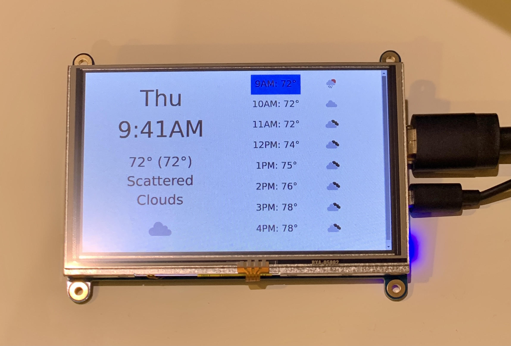

# weatherdash

This is the server side portion of a weather dashboard for your house, using
data and icons from <https://openweathermap.org/>.

The idea is that you put a portable computer (like a Raspberry Pi, or similar)
somewwhere running Chrome and load this web page. This dashboard can be running
on your portable computer, or somewhere else.

It's designed to look good on an 800x640 screen, like this one:
<https://www.adafruit.com/product/2260>

Here's a photo of weatherdash running on that screen:



Someday if I'm not too lazy I'll write a little tutorial on this whole process!


## Installation

Copy `config.json.example` to `config.json` to start. You only _need_ to update
keys that have a value of `FILL_ME_IN` in `config.json.example`.

### Step 1: Virtualenv

You need Python 3 (which we expect to be called `python3`), and pip (which we
expect to be called `pip3`).

You can install all dependencies in a virtualenv like this:
```
make
```

If you just want to see a demo at this point, you can run `make run` and visit
http://localhost:5000/fake -- that will read fake weather data stored locally.
You must have a config.json file, but you need not change it at all.

To get live weather data for your location, continue.

### Step 2: API Key

You need to get your own API key for <https://openweathermap.org/>. 
Put your API key in the `api_key` field of `config.json`.

### Step 3: Location

You have should pick location to get weather for! The default is New York City.

You can use <https://www.latlong.net/> for this. The config expects numerical
(positive and negative numbers, no north/south or east/west), like this website
provides. Put these in the `lat` and `lon` fields of `config.json`.

## Running the Dashboard

You can run the dashboard like this:
```
make run
```

Then you can visit http://localhost:5000 to see the dashboard.
